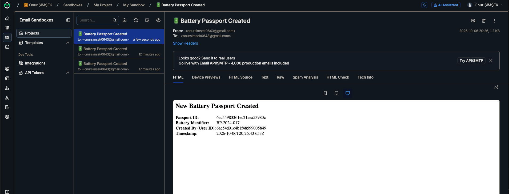

# MEAtec Battery Passport Platform — Backend

A microservices-based backend system for managing digital battery passports, built for the EU EV sustainability ecosystem.

---

## Architecture Overview

```
┌──────────────┐   HTTP/JWT    ┌──────────────────┐   HTTP/JWT   ┌──────────────────┐
│    Client    │──────────────►│  Auth Service    │◄────────────│ Passport Service │
│  (Postman /  │               │  :3001           │             │  :3002           │
│   Frontend)  │               └──────────────────┘             └────────┬─────────┘
│              │──────────────────────────────────────────────────────────┘
│              │   HTTP/JWT    ┌──────────────────┐              │ Kafka events
│              │──────────────►│ Document Service │              ▼
│              │               │  :3003           │   ┌──────────────────────┐
└──────────────┘               └──────────────────┘   │ Notification Service │
                                                       │  (Kafka Consumer)    │
                                                       │  → Mailtrap SMTP     │
                                                       └──────────────────────┘
```

### Services

| Service | Port | Description |
|---|---|---|
| `auth-service` | 3001 | User registration, login, JWT issuance, token verification |
| `passport-service` | 3002 | Battery passport CRUD, Kafka event emission |
| `document-service` | 3003 | File upload to S3, metadata management |
| `notification-service` | — | Kafka consumer, sends email notifications via SMTP |

### Communication Patterns

- **Synchronous HTTP**: `passport-service` and `document-service` call `auth-service` to verify JWTs on every protected request
- **Asynchronous Kafka**: `passport-service` emits `passport.created`, `passport.updated`, `passport.deleted` events that `notification-service` consumes

---

## Tech Stack

- **Runtime**: Node.js 20 + Express.js
- **Database**: MongoDB 7 (via Mongoose)
- **Message Broker**: Apache Kafka (via KafkaJS)
- **File Storage**: AWS S3-compatible via LocalStack
- **Authentication**: JWT + bcrypt
- **Email**: Nodemailer + Mailtrap SMTP
- **Docs**: Swagger UI (OpenAPI 3.0)
- **Logging**: Winston
- **Testing**: Jest + Supertest + MongoMemoryServer
- **Infrastructure**: Docker + Docker Compose

---

## Setup & Running

### Prerequisites

- [Docker Desktop](https://www.docker.com/products/docker-desktop/) (running)
- Node.js 20+ & npm (if running services locally or executing tests)

---

### 1. Environment Configuration

Clone the repository and copy the example environment files:

```bash
git clone <repo-url>
cd meatec_case_study

# Root environment (MongoDB root credentials)
cp .env.example .env

# Service-specific environments
cp auth-service/.env.example auth-service/.env
cp passport-service/.env.example passport-service/.env
cp document-service/.env.example document-service/.env
cp notification-service/.env.example notification-service/.env
```

1. **In root `.env`**: Set your `MONGO_ROOT_USER` and `MONGO_ROOT_PASS`.
2. **In `auth-service/.env`, `passport-service/.env`, `document-service/.env`**: Replace `<MONGO_ROOT_USER>` and `<MONGO_ROOT_PASS>` with the values you set above.
3. **In `notification-service/.env`**: Add your free [Mailtrap](https://mailtrap.io) credentials (`SMTP_USER` and `SMTP_PASS`).

> 💡 **Note on Networking:** All containers run inside an isolated Docker bridge network (`meatec_net`). Docker Compose automatically handles internal routing (`mongo:27017`, `kafka:29092`, `localstack:4566`, `auth-service:3001`), while mapping public ports (`3001`, `3002`, `3003`, `27018`) to `localhost` so you can immediately interact with them via your browser, Swagger, or Postman.

---

### 2. Start Everything with One Command

Spin up all 4 microservices along with MongoDB, Kafka, Zookeeper, and LocalStack:

```bash
npm run docker:up
```

*(Under the hood, this executes `docker compose up --build -d`).*

* **Zero-Touch LocalStack S3**: The S3 bucket `meatec-documents` is initialized automatically on container startup via `scripts/init-localstack.sh` mounted in `/etc/localstack/init/ready.d/`.
* **Stream Logs**: `npm run docker:logs` (or `docker compose logs -f notification-service`)
* **Check Status**: `docker compose ps`
* **Stop Everything**: `npm run docker:down`

---

### 3. Verification & Smoke Test (3 Steps)

Once containers are running, verify the full end-to-end pipeline:

#### Step 1: Register an Admin User
```bash
curl -X POST http://localhost:3001/api/auth/register \
  -H "Content-Type: application/json" \
  -d '{
    "email": "admin@meatec.com",
    "password": "Password123!",
    "role": "admin"
  }'
```
*Returns `201 Created` with JWT `token` and user details. Copy the token.*

#### Step 2: Create a Battery Passport
```bash
TOKEN="<paste-your-jwt-token-here>"

curl -X POST http://localhost:3002/api/passports \
  -H "Authorization: Bearer $TOKEN" \
  -H "Content-Type: application/json" \
  -d '{
    "data": {
      "generalInformation": {
        "batteryIdentifier": "BAT-TEST-001",
        "batteryModel": {
          "id": "MOD-001",
          "modelName": "CellPack Ultra"
        },
        "batteryCategory": "EV",
        "batteryMass": 450
      }
    }
  }'
```
*Returns `201 Created`. The passport is stored in MongoDB, and a `passport.created` event is published to Kafka.*

#### Step 3: Verify Email in Mailtrap & Check Logs
1. **Check Notification Service Logs**:
   ```bash
   cat notification-service/logs/combined.log
   ```
   You will see the event consumption and email dispatch:
   ```text
   [INFO] Kafka event received ← passport.created | key: <passportId>
   [INFO] [Email Dispatch] Preparing to send email → To: admin@meatec.com | Subject: "🔋 Battery Passport Created"
   [INFO] [Email Dispatch] Email sent successfully → messageId: <messageId>
   ```
2. **View Email in Mailtrap**:
   Log into [Mailtrap Dashboard](https://mailtrap.io) → **Email Testing** → **Inboxes** → **My Inbox**. You will see the email with formatted HTML table details:

   

---

### 4. Running Tests

Run all unit and integration test suites across all 4 microservices:

```bash
# Run all test suites in one go:
npm test

# Or run individual service tests:
npm test --prefix auth-service
npm test --prefix passport-service
npm test --prefix document-service
npm test --prefix notification-service
```

---

## API Reference

### Auth Service — `http://localhost:3001`

| Method | Endpoint | Access | Description |
|---|---|---|---|
| POST | `/api/auth/register` | Public | Register user |
| POST | `/api/auth/login` | Public | Login, returns JWT |
| POST | `/api/auth/verify` | Internal | Verify JWT (used by other services) |

**Register body:**
```json
{
  "email": "admin@example.com",
  "password": "password123",
  "role": "admin"
}
```

**Login body:**
```json
{
  "email": "admin@example.com",
  "password": "password123"
}
```

---

### Passport Service — `http://localhost:3002`

All endpoints require `Authorization: Bearer <token>` header.

| Method | Endpoint | Access | Description |
|---|---|---|---|
| POST | `/api/passports` | admin | Create passport |
| GET | `/api/passports/:id` | admin, user | Get passport |
| PUT | `/api/passports/:id` | admin | Update passport |
| DELETE | `/api/passports/:id` | admin | Delete passport |

**Sample passport body:**
```json
{
  "data": {
    "generalInformation": {
      "batteryIdentifier": "BP-2024-011",
      "batteryModel": { "id": "LM3-BAT-2024", "modelName": "GMC WZX1" },
      "batteryMass": 450,
      "batteryCategory": "EV",
      "batteryStatus": "Original",
      "manufacturingDate": "2024-01-15",
      "manufacturingPlace": "Gigafactory Nevada",
      "warrantyPeriod": "8",
      "manufacturerInformation": {
        "manufacturerName": "Tesla Inc",
        "manufacturerIdentifier": "TESLA-001"
      }
    },
    "materialComposition": {
      "batteryChemistry": "LiFePO4",
      "criticalRawMaterials": ["Lithium", "Iron"],
      "hazardousSubstances": [{
        "substanceName": "Lithium Hexafluorophosphate",
        "chemicalFormula": "LiPF6",
        "casNumber": "21324-40-3"
      }]
    },
    "carbonFootprint": {
      "totalCarbonFootprint": 850,
      "measurementUnit": "kg CO2e",
      "methodology": "Life Cycle Assessment (LCA)"
    }
  }
}
```

---

### Document Service — `http://localhost:3003`

All endpoints require `Authorization: Bearer <token>` header.

| Method | Endpoint | Access | Description |
|---|---|---|---|
| POST | `/api/documents/upload` | any auth | Upload file (multipart/form-data) |
| GET | `/api/documents/:docId` | any auth | Get pre-signed download URL (15 min) |
| PUT | `/api/documents/:docId` | any auth | Update document description |
| DELETE | `/api/documents/:docId` | admin | Delete file + metadata |

**Upload (multipart/form-data):**
```
field: file  → the file binary
field: description  → optional string
```

**Response:**
```json
{
  "docId": "6ac50faf...",
  "fileName": "report.pdf",
  "createdAt": "2026-10-06T14:00:00.000Z"
}
```

---

## Kafka Topics & Payload Structure

| Topic | Emitted By | Consumed By | Description |
|---|---|---|---|
| `passport.created` | passport-service | notification-service | New passport created |
| `passport.updated` | passport-service | notification-service | Passport data changed |
| `passport.deleted` | passport-service | notification-service | Passport removed |

**Payload structure (all topics):**
```json
{
  "passportId": "6ac505a7...",
  "batteryIdentifier": "BP-2024-011",
  "createdBy": "6ac504103...",
  "timestamp": "2026-10-06T14:28:55.316Z"
}
```
> `updatedBy` and `deletedBy` replace `createdBy` in their respective events.

---

## Swagger Docs

| Service | URL |
|---|---|
| Auth Service | http://localhost:3001/api-docs |
| Passport Service | http://localhost:3002/api-docs |
| Document Service | http://localhost:3003/api-docs |

---

## MongoDB Connection Strings

For MongoDB Compass or similar tools (replace with your configured credentials):
```
mongodb://<MONGO_ROOT_USER>:<MONGO_ROOT_PASS>@localhost:27018
```

| Database | Collection | Contents |
|---|---|---|
| `auth_db` | `users` | Registered users |
| `passport_db` | `batterypassports` | Battery passports |
| `document_db` | `documents` | File metadata |

---

## Cloud Deployment (Render)

The microservices are deployed on **Render** using [`render.yaml`](render.yaml) connected to MongoDB Atlas and Supabase S3 storage.

> **Note on Kafka in Cloud Deployment:**
> The live deployment on Render provides publicly accessible REST endpoints and Swagger interfaces. However, because no free cloud Kafka instance is available without credit card requirements, Kafka is not connected in the Render environment (the services handle this gracefully and serve all HTTP requests normally).
> 
> **The complete end-to-end architecture**—including Apache Kafka event streaming, Zookeeper, the Notification consumer, LocalStack S3, and Mailtrap email dispatch—**runs out-of-the-box via Docker Compose**:
> ```bash
> npm run docker:up
> ```